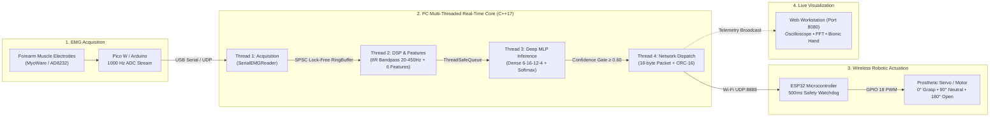

# EMG-Based Real-Time Actuator Control System

[](https://en.wikipedia.org/wiki/C%2B%2B17)
[](https://cmake.org/)
[]()
[]()
[]()
[]()

A high-speed, multi-threaded biomedical telemetry and robotic actuator control platform. The system acquires electromyography (EMG) muscle signals from a forearm sensor (via Raspberry Pi Pico W or Arduino), filters noise, extracts clinical time-domain features, classifies hand gestures using a Deep Neural Network (MLP), and transmits verified, fail-safe binary motor control packets over UDP Wi-Fi to an ESP32 micro-controller driving a prosthetic robotic servo.

Includes an interactive **60 FPS Bionic Telemetry Web Workstation** with live oscilloscope, FFT power spectrum, and multi-class neural network probability visualizer.

---

## Table of Contents
1. [Architecture & Threading Model](#system-architecture)
2. [Hardware Requirements & Wiring Guide](#hardware-requirements--wiring)
3. [Quick Start: Zero-Hardware Demo (Run in 60s)](#quick-start-zero-hardware-demo)
4. [Step-by-Step Hardware Setup](#step-by-step-hardware-setup)
   - [A. Flashing the Sensor Microcontroller (Pico W / Arduino)](#a-sensor-firmware-setup)
   - [B. Flashing the Actuator Microcontroller (ESP32)](#b-actuator-firmware-setup)
5. [Machine Learning & Arm Calibration](#machine-learning--arm-calibration)
6. [Building the PC C++ Application](#building-the-pc-application)
7. [Running the System](#running-the-system)
8. [Telemetry Web Dashboard](#telemetry-web-dashboard)
9. [Configuration Reference (`config.json`)](#configuration-reference)
10. [Troubleshooting & FAQs](#troubleshooting--faqs)

---

## System Architecture



### Multi-Threaded Real-Time Pipeline
| Thread | Component | Responsibility | Latency |
| :--- | :--- | :--- | :--- |
| **Thread 1** | Acquisition | Reads raw ADC samples from USB Serial / Pico W at 1000 Hz | `< 0.5 ms` |
| **Thread 2** | Preprocessing | DC offset removal, 20–450 Hz IIR bandpass, 6 time-domain features | `< 1.2 ms` |
| **Thread 3** | ML Inference | Deep Neural Network forward pass, Softmax, fail-safe gating | `< 10 µs` |
| **Thread 4** | Networking | Sequence monotonicity, CRC-16 calculation, UDP transmission | `< 0.4 ms` |

### Gesture & Actuator Decision Mapping
| Class ID | Command | Forearm Action | Actuator / Servo Angle | Safe State Behavior |
| :---: | :--- | :--- | :---: | :--- |
| **1** | `RELAX` | Arm relaxed on table | **90°** (Neutral) | Default baseline position |
| **2** | `GRASP` | Tight fist (flexors) | **0°** (Closed Grip) | Full motor grasp |
| **3** | `OPEN` | Spread fingers wide | **180°** (Full Open) | Full extension |
| **4** | `CLOSE` | Thumb/index pinch | **0°** (Closed Grip) | Precision pinch grip |
| **0** | `NONE` | Low confidence (< 0.60) | **90°** (Safe State) | Failsafe override |

---

## Hardware Requirements & Wiring

### 1. Components Needed
- **Sensor Acquisition**: Raspberry Pi Pico W (or Arduino Uno / Nano / ESP32)
- **EMG Sensor**: MyoWare 2.0, MyoWare 1.0, or AD8232 ECG/EMG module + 3 gel electrode pads
- **Actuator Microcontroller**: ESP32 DevKit v1 (or NodeMCU-32S)
- **Servo Motor**: SG90 Micro Servo, MG90S, or high-torque MG996R
- **Cables & Power**: Micro-USB cables, jumper wires, breadboard, external 5V 2A power supply for servo

---

### 2. Wiring Diagram

#### A. EMG Sensor → Raspberry Pi Pico W
| EMG Sensor Pin | Raspberry Pi Pico W Pin | Description |
| :--- | :--- | :--- |
| **+ / VIN** | **3V3 (Pin 36)** | 3.3V Clean Power |
| **- / GND** | **GND (Pin 38 or 28)** | System Ground |
| **SIG / OUT** | **GP26 / ADC0 (Pin 31)** | Analog EMG Signal |

> **Electrode Pad Placement on Forearm**:
> - **Red Pad**: Middle of forearm muscle belly (flexor carpi radialis).
> - **Blue Pad**: 2–3 cm along the same muscle in line with the tendon.
> - **Black Pad (Reference)**: Bony, non-muscular area (e.g. elbow bone or back of wrist).

#### B. ESP32 → Servo Motor
| Servo Wire | ESP32 Pin | Power Supply | Notes |
| :--- | :--- | :--- | :--- |
| **Signal (Orange/Yellow)** | **GPIO 18** | — | Hardware PWM output (50 Hz) |
| **Power (Red / VCC)** | — | **External +5V** | **Do NOT power motor from ESP32 3.3V** |
| **Ground (Brown/Black)** | **GND** | **External GND** | **Connect ESP32 GND and 5V GND together!** |

---

## Quick Start: Zero-Hardware Demo

You can test and evaluate the entire system right on your computer without plugging in any hardware:

### Step 1: Start the Web Dashboard Workstation
```bash
python dashboard/server.py
```
Open your browser to: **[http://localhost:8080](http://localhost:8080)**

### Step 2: Start the Simulated ESP32 Receiver
In a second terminal:
```bash
python tests/simulate_esp32.py 8888
```

### Step 3: Start the C++ Control Pipeline
In a third terminal:
```bash
./pc/build/emg_control.exe pc/config.json
```

**What you will see:**
1. The C++ pipeline generates synthetic EMG muscle contractions, extracts features, runs native Deep Neural Network inference, and streams binary packets over UDP.
2. The simulated ESP32 verifies CRC-16 checksums, sequence numbers, and prints servo angle adjustments.
3. The web dashboard at `http://localhost:8080` displays a 60 FPS oscilloscope, frequency spectrum, live Softmax probability distribution, and an articulated cybernetic bionic hand!

---

## Step-by-Step Hardware Setup

### A. Sensor Firmware Setup (Raspberry Pi Pico W)

#### Option 1: MicroPython (Recommended for Pico W)
1. Install [Thonny IDE](https://thonny.org/).
2. Connect your Pico W while holding the `BOOTSEL` button, then flash MicroPython.
3. Open `pico_w_sensor/main.py` in Thonny.
4. Click **Save to Raspberry Pi Pico** as `main.py`.
5. Unplug and replug the Pico W. It will stream raw ADC readings over USB Serial at 1000 Hz.
6. Note the COM port assigned to the Pico W in Windows Device Manager (e.g. `COM3`).

#### Option 2: Arduino C++ (Arduino Uno / Nano / Pico W)
1. Open `sensor_arduino/sensor_arduino.ino` in Arduino IDE.
2. Select your board and port.
3. Click **Upload**.

---

### B. Actuator Firmware Setup (ESP32)

1. Open `esp32/esp32_emg_actuator/esp32_emg_actuator.ino` in Arduino IDE (or PlatformIO in `esp32/`).
2. Update your Wi-Fi credentials:
   ```cpp
   const char* ssid     = "YOUR_WIFI_SSID";
   const char* password = "YOUR_WIFI_PASSWORD";
   ```
3. Upload to your ESP32.
4. Open the Serial Monitor at **115200 baud**.
5. When connected to Wi-Fi, note the IP address displayed:
   ```
   WiFi connected! IP: 192.168.1.150
   UDP receiver started on port 8888
   ```
6. In `pc/config.json`, enter this IP address under `"udp"`:
   ```json
   "udp": {
       "esp32_ip": "192.168.1.150",
       "esp32_port": 8888
   }
   ```

---

## Machine Learning & Arm Calibration

This project features a complete dual-phase Deep Learning pipeline:

### 1. Out-of-the-Box Inference (No training required!)
The repository comes bundled with pre-calibrated default weights in [`models/emg_mlp_weights.json`](file:///d:/EMG/models/emg_mlp_weights.json). In addition, `pc/src/neural_net_model.cpp` has embedded default fallback weights. You can run inference immediately without training.

### 2. Training on Your Own Arm (Recommended for maximum physical accuracy)
Because each person's forearm muscle volume and skin impedance differ, you can train a personalized model tailored to your arm in **30 seconds**:

```bash
# With your Pico W / Arduino connected to COM3:
python ml/train_my_arm.py --port COM3 --duration 6

# Or train on realistic synthetic EMG data without hardware:
python ml/train_my_arm.py --synthetic --epochs 80
```

#### What `train_my_arm.py` does:
1. Gives you a 3-2-1 countdown and prompts you to hold 4 gestures:
   - **RELAX**: Rest arm flat on table (5 sec).
   - **GRASP**: Make a firm fist (5 sec).
   - **OPEN**: Spread fingers wide open (5 sec).
   - **CLOSE**: Pinch thumb and index together (5 sec).
2. Extracts 6 features window by window: `[RMS, MAV, VAR, WL, ZC, SSC]`.
3. Trains a Deep Multi-Layer Perceptron (6 inputs → 16 hidden ReLU → 12 hidden ReLU → 4 Softmax).
4. Evaluates accuracy and confusion matrix (typically 98–100%).
5. Automatically writes the trained weights to `models/emg_mlp_weights.json`.

---

## Building the PC Application

### Prerequisites
- **CMake**: version 3.16 or newer
- **Compiler**: GCC 9+ (MinGW-w64 / MSYS2 UCRT64 on Windows), Clang 10+, or MSVC 2019+
- **Build Tool**: Ninja or Make
- **Python**: 3.9+

### Build on Windows (MSYS2 UCRT64 / Ninja)
```powershell
cd d:\EMG
cmake -B pc/build -S pc -G Ninja
ninja -C pc/build
```

### Build on Linux / macOS
```bash
cmake -B pc/build -S pc
cmake --build pc/build
```

### Running the Unit Test Suite
The repository includes 40 comprehensive unit tests verifying the lock-free circular ring buffer, bounded thread-safe queue, IIR bandpass filter, feature extractor, neural network forward pass, Softmax normalization, UDP packet serialization, and CRC-16 checksums:

```powershell
d:\EMG\pc\build\emg_tests.exe
```
*Expected output:*
```
========================================
  Results: 40 passed, 0 failed, 40 total
========================================
```

---

## Running the System

### Running with Real Hardware (Physical Arm + Pico W + ESP32)
1. In `pc/config.json`, configure:
   ```json
   "emg": {
       "source": "serial",
       "serial_port": "COM3",
       "serial_baud_rate": 115200
   },
   "ml": {
       "model_type": "neural_net",
       "model_path": "models/emg_mlp_weights.json"
   },
   "udp": {
       "esp32_ip": "192.168.1.150",
       "esp32_port": 8888
   }
   ```
2. Start the telemetry workstation:
   ```bash
   python dashboard/server.py
   ```
3. Run the PC control engine:
   ```bash
   ./pc/build/emg_control.exe pc/config.json
   ```
4. Flex your arm! The servo moves instantly with sub-millisecond responsiveness.

---

## Telemetry Web Dashboard

Open **[http://localhost:8080](http://localhost:8080)** to access the live workstation.

### Workstation Highlights:
- **Multi-Mode Oscilloscope**: Switch between **Time-Domain (1 kHz)**, **FFT Frequency Spectrum (20–450 Hz)** with Median Power Frequency (MDF) tracking, or **Dual Split View**.
- **Deep Neural Network Softmax Visualizer**: Displays live probability bars for all 4 classes (`RELAX`, `GRASP`, `OPEN`, `CLOSE`) with the winning class illuminated.
- **Articulated Cybernetic Hand**: 5 articulating mechanical fingers that flex, pinch, or spread wide in real time matching the servo position.
- **1-Click CSV Export**: Click **EXPORT CSV** to download captured EMG feature telemetry for clinical data analysis.
- **Fail-Safe Watchdog Indicator**: Alerts immediately if sensor communication drops.

### Keyboard Shortcuts:
| Key | Action |
| :---: | :--- |
| `1` | Test command: **RELAX (90°)** |
| `2` | Test command: **GRASP (0°)** |
| `3` | Test command: **OPEN (180°)** |
| `4` | Test command: **CLOSE (0°)** |
| `SPACE` | Trigger **SAFE STATE (90°)** |
| `P` | Pause / Resume Oscilloscope |
| `T` | Open Arm Calibration Modal |

---

## Configuration Reference

Edit `pc/config.json` to tune system behavior:

```json
{
    "emg": {
        "sample_rate_hz": 1000,          // Sensor ADC sampling rate
        "source": "serial",              // "serial" for physical hardware, "fake" for simulation
        "serial_port": "COM3",           // COM port of Pico W / Arduino
        "serial_baud_rate": 115200       // Serial speed
    },
    "processing": {
        "window_size": 256,              // Sliding analysis window (256 ms)
        "window_overlap": 128,           // Window step / hop size (50% overlap)
        "filter_low_hz": 20.0,           // Highpass cutoff: removes movement artifact
        "filter_high_hz": 450.0,         // Lowpass cutoff: anti-aliasing limit
        "normalize": true                // Peak normalization
    },
    "features": {
        "rms": true, "mav": true, "variance": true,
        "waveform_length": true, "zero_crossings": true, "slope_sign_changes": true
    },
    "ml": {
        "model_type": "neural_net",      // "neural_net" (Deep MLP) or "mock"
        "model_path": "models/emg_mlp_weights.json",
        "confidence_threshold": 0.60     // Safe threshold: below 0.60 defaults to NONE
    },
    "udp": {
        "esp32_ip": "192.168.1.150",     // IP address of your ESP32
        "esp32_port": 8888,              // UDP port on ESP32
        "send_rate_hz": 20               // Command transmission rate
    },
    "safety": {
        "watchdog_timeout_ms": 500       // Auto-neutral if packets stop for 500 ms
    }
}
```

---

## Troubleshooting & FAQs

#### 1. How do I find my Pico W / Arduino COM port?
- On Windows, press `Win + X` → **Device Manager** → expand **Ports (COM & LPT)**. Look for `USB Serial Device` or `Silicon Labs CP210x` (e.g. `COM3`).
- On Linux, run `ls /dev/ttyACM* /dev/ttyUSB*`.

#### 2. The servo jitters or the ESP32 reboots when the motor moves.
- **Cause**: The servo draws peak current (> 1 A) which sags the ESP32 board power.
- **Solution**: Power the servo from an external 5V 2A power brick. **Ensure the ground of the 5V supply is connected to the ESP32 GND.**

#### 3. UDP packets are not reaching the ESP32.
- Check Windows Firewall: allow incoming/outgoing UDP packets on port `8888`.
- Ensure your PC and the ESP32 are connected to the **same 2.4 GHz Wi-Fi network** (ESP32 does not support 5 GHz Wi-Fi).
- Ping the ESP32 IP from your PC: `ping 192.168.1.150`.

#### 4. The model prediction stays on "RELAX" even when flexing.
- Clean your forearm with an alcohol wipe to remove skin oils.
- Ensure the reference electrode (black wire) is placed on a bone (elbow/wrist).
- Run `python ml/train_my_arm.py --port COM3 --duration 6` to calibrate the neural network to your muscle impedance.

---

## Project Structure

```
d:\EMG/
├── pc/                          # PC-side C++17 real-time engine
│   ├── include/                 # Header files (ring buffer, queues, pipeline, neural net)
│   ├── src/                     # C++ implementations (signal processor, features, UDP sender)
│   ├── tests/                   # 40 automated unit tests (test_main, test_neural_net, etc.)
│   ├── config.json              # Main runtime configuration
│   └── CMakeLists.txt           # CMake build script
├── ml/                          # Machine learning suite
│   └── train_my_arm.py          # Arm muscle recording and Deep MLP training script
├── models/                      # Trained model artifacts
│   └── emg_mlp_weights.json     # Pre-trained deep neural network weights
├── dashboard/                   # Bionic Telemetry Workstation
│   ├── index.html               # Workstation UI layout
│   ├── style.css                # Medical glassmorphic styling
│   ├── app.js                   # 60 FPS oscilloscope, FFT, & bionic hand animator
│   └── server.py                # Python HTTP, WebSocket, & UDP telemetry hub
├── pico_w_sensor/               # Raspberry Pi Pico W acquisition firmware
│   ├── main.py                  # 1000 Hz MicroPython acquisition script
│   ├── pico_w_sensor.ino        # Arduino C++ version for Pico W
│   └── wifi_udp_transmitter.py  # Wireless UDP transmitter for Pico W
├── esp32/                       # ESP32 actuator firmware
│   ├── esp32_emg_actuator/      # Arduino IDE project with 500ms safety watchdog
│   └── src/main.cpp             # PlatformIO C++ source
├── sensor_arduino/              # Universal sensor sketch for Arduino Uno/Nano/ESP32
└── tests/                       # Integration test suite
    ├── simulate_esp32.py        # Hardware-free ESP32 receiver simulator
    └── test_integration_e2e.py  # End-to-end socket validation script
```

---

## License

This project is licensed under the MIT License — feel free to use and modify for personal, educational, or commercial robotics projects.
