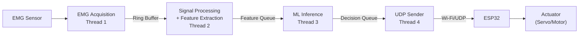

# EMG-Based Real-Time Actuator Control System

A modular, multithreaded C++17 system that acquires EMG (electromyography) signals, processes them through a machine-learning pipeline, and sends classified motor commands to an ESP32 microcontroller over UDP.

## Architecture Overview



### Decision Mapping

| Class ID | Command | Description |
|----------|---------|-------------|
| 1 | RELAX | No action / safe state |
| 2 | GRASP | Close grip |
| 3 | OPEN | Open grip |
| 4 | CLOSE | Full close |

### Threading Model

| Thread | Responsibility | Input | Output |
|--------|---------------|-------|--------|
| Thread 1 | EMG Acquisition | Sensor (serial/mock) | Ring Buffer |
| Thread 2 | Signal Processing + Feature Extraction | Ring Buffer | Feature Queue |
| Thread 3 | ML Inference + Decision | Feature Queue | Decision Queue |
| Thread 4 | UDP Communication | Decision Queue | Network |

## Project Structure

```
emg-control/
├── pc/                  # PC-side C++17 application
│   ├── include/         # Header files
│   ├── src/             # Source files
│   ├── tests/           # Unit tests
│   ├── CMakeLists.txt   # Build system
│   └── config.json      # Runtime configuration
├── esp32/               # ESP32 firmware (PlatformIO)
│   ├── include/         # Header files
│   ├── src/             # Source files
│   └── platformio.ini   # PlatformIO config
├── docs/                # Documentation
│   ├── architecture.md  # System architecture
│   ├── protocol.md      # UDP protocol specification
│   ├── threading.md     # Threading model
│   └── testing.md       # Test strategy
└── README.md            # This file
```

## Building

### PC Application

**Prerequisites**: CMake 3.16+, C++17-capable compiler (MSVC 2019+, GCC 9+, Clang 10+)

```bash
cd pc
mkdir build && cd build
cmake ..
cmake --build .
```

### Running Unit Tests

```bash
cd pc/build
ctest --output-on-failure
```

### Running Hardware-Free ESP32 Simulator & Live Demo

You can test and observe the complete end-to-end real-time system without physical hardware:

**Terminal 1 (Simulated ESP32 Receiver & Servo):**
```bash
python tests/simulate_esp32.py 8888
```

**Terminal 2 (EMG Pipeline):**
```bash
# In pc/config.json, set "esp32_ip": "127.0.0.1", "esp32_port": 8888
./pc/build/emg_control.exe pc/config.json
```

### Automated End-to-End Integration Test

```bash
python tests/test_integration_e2e.py
```

### ESP32 Firmware (Hardware Deployment)

**Prerequisites**: [PlatformIO](https://platformio.org/)

```bash
cd esp32
pio run              # Compile
pio run -t upload    # Flash to ESP32
pio device monitor   # Serial monitor
```

## Machine Learning & Deep Learning (Option 1 + Option 2)

This system features a complete, professional dual-phase Deep Learning architecture:

### 1. Option 2: Training on Your Arm (`ml/train_my_arm.py`)
Because forearm muscle geometry and skin impedance differ for each individual, you can record and train a custom Deep Neural Network on your own arm in under 30 seconds:

```bash
# To record your physical arm via Pico W / Arduino Serial:
python ml/train_my_arm.py --port COM3 --duration 6

# Or train immediately with synthetic physiological EMG data (no hardware needed):
python ml/train_my_arm.py --synthetic --epochs 80
```

- Guides you through an interactive countdown for 4 gestures (**RELAX**, **GRASP**, **OPEN**, **CLOSE**).
- Extracts 6 time-domain features (**RMS**, **MAV**, **VAR**, **WL**, **ZC**, **SSC**).
- Trains a 3-layer Deep Multi-Layer Perceptron (`Dense(16, ReLU) -> Dense(12, ReLU) -> Dense(4, Softmax)`).
- Automatically exports weights to `models/emg_mlp_weights.json`.

### 2. Option 1: Native C++ Real-Time Inference (`NeuralNetModel`)
The C++ pipeline loads `models/emg_mlp_weights.json` and runs the forward pass directly in native C++ with **< 10 µs latency**:

- Zero external Python runtime or DLL dependencies at execution time.
- Embedded fallback weights ensure the pipeline operates out-of-the-box even without a weights file.
- Gated by confidence thresholding (`confidence >= 0.60`) in `emg::DecisionEngine` before transmitting UDP commands to the ESP32 servo.

## Configuration

Edit `pc/config.json` to configure:

- EMG acquisition parameters (sample rate, buffer size, serial port)
- Processing & feature extraction (window size 256, overlap 128, 6 features)
- ML model (`"model_type": "neural_net"`, `"model_path": "models/emg_mlp_weights.json"`, `"confidence_threshold": 0.6`)
- Decision mapping (class ID → command)
- UDP connection (ESP32 IP address, port)
- Safety timeouts

## Safety

This system implements conservative safety behavior:

- **Low ML confidence** → `Command::NONE` (no actuator action)
- **Sensor disconnect** → Pipeline drains, actuator stops
- **UDP timeout** → ESP32 enters safe state (actuator stops)
- **Invalid/stale packets** → Discarded, actuator unaffected
- **Queue overflow** → Oldest entries dropped (never blocks producer)

## License

Private project. All rights reserved.
