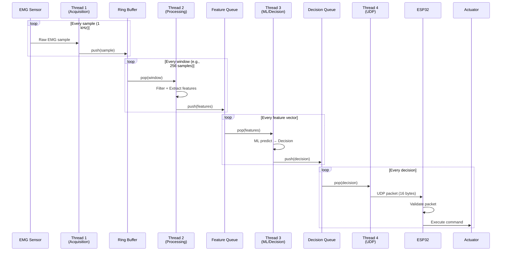
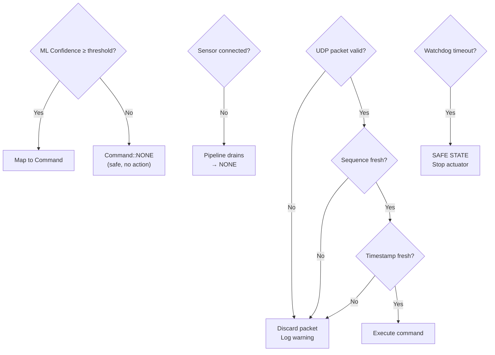

# System Architecture

## Overview

The EMG-Based Real-Time Actuator Control System is a multithreaded pipeline that transforms raw EMG sensor signals into discrete actuator commands, transmitted over UDP to an ESP32 microcontroller.

## High-Level Architecture

```mermaid
flowchart TD
    subgraph "EMG Sensor Hardware"
        SENSOR["EMG Sensor<br/>(Serial / USB)"]
    end

    subgraph PC["PC Application — C++17, 4 Threads"]
        subgraph T1["Thread 1: Acquisition"]
            EMG_READER["EMGReader<br/>(FakeEMGReader / SerialEMGReader)"]
        end

        RB[("Ring Buffer<br/>(SPSC, Lock-free, Bounded)")]

        subgraph T2["Thread 2: Processing"]
            SIG_PROC["SignalProcessor<br/>Bandpass filter, normalization"]
            FEAT["FeatureExtractor<br/>RMS, MAV, Var, WL, ZC, SSC"]
        end

        FQ[("Feature Queue<br/>(ThreadSafeQueue, Bounded)")]

        subgraph T3["Thread 3: ML + Decision"]
            ML["MLModel<br/>(MockMLModel / TFLite / ONNX)"]
            DEC["DecisionEngine<br/>Confidence threshold + mapping"]
        end

        DQ[("Decision Queue<br/>(ThreadSafeQueue, Bounded)")]

        subgraph T4["Thread 4: Communication"]
            UDP_SEND["UDPSender<br/>Structured binary packets"]
        end
    end

    subgraph NET["Network"]
        WIFI["UDP over Wi-Fi"]
    end

    subgraph ESP["ESP32 Firmware"]
        UDP_RX["UDPReceiver<br/>Packet validation"]
        WATCHDOG["SafetyWatchdog<br/>Timeout → safe state"]
        ACT_CTRL["ActuatorController<br/>(ServoActuator / MockActuator)"]
    end

    SENSOR -->|"raw samples"| EMG_READER
    EMG_READER -->|"push"| RB
    RB -->|"pop"| SIG_PROC
    SIG_PROC --> FEAT
    FEAT -->|"feature vector"| FQ
    FQ -->|"pop"| ML
    ML --> DEC
    DEC -->|"Command + confidence"| DQ
    DQ -->|"pop"| UDP_SEND
    UDP_SEND -->|"16-byte packet"| WIFI
    WIFI -->|"UDP"| UDP_RX
    UDP_RX --> ACT_CTRL
    ACT_CTRL --> WATCHDOG
```

## Component Descriptions

### PC-Side Components

| Component | Responsibility | Interface |
|-----------|---------------|-----------|
| **EMGReader** | Abstract interface for EMG data acquisition | `virtual std::vector<double> readSamples()` |
| **FakeEMGReader** | Generates synthetic EMG signals for testing | Implements `EMGReader` |
| **SerialEMGReader** | Reads from real serial-connected EMG sensor | Implements `EMGReader` (stub) |
| **RingBuffer\<T\>** | Lock-free SPSC bounded buffer for raw EMG data | `push()`, `pop()`, `tryPop()` |
| **SignalProcessor** | Bandpass filtering (20–450 Hz), DC removal, normalization | `process(raw_window) → filtered` |
| **FeatureExtractor** | Computes configurable EMG features | `extract(filtered) → feature_vector` |
| **MLModel** | Abstract interface for ML inference | `predict(features) → {class_id, confidence}` |
| **MockMLModel** | Deterministic classifier for testing | Implements `MLModel` |
| **DecisionEngine** | Maps ML output to commands with confidence gating | `decide(prediction) → Command` |
| **ThreadSafeQueue\<T\>** | Bounded, thread-safe queue with shutdown semantics | `push()`, `pop()`, `tryPop()`, `shutdown()` |
| **UDPSender** | Serializes and transmits command packets over UDP | `send(CommandPacket)` |
| **CommandPacket** | 16-byte binary packet with CRC-16 validation | `serialize()`, `deserialize()` |
| **Config** | JSON-based runtime configuration | Loads `config.json` |
| **Logger** | Thread-safe logging with levels and timestamps | `log(level, message)` |
| **Pipeline** | Top-level orchestrator — creates threads, manages lifecycle | `start()`, `stop()` |

### ESP32-Side Components

| Component | Responsibility |
|-----------|---------------|
| **WiFiManager** | Connects to Wi-Fi, handles reconnection |
| **UDPReceiver** | Receives and validates UDP command packets |
| **ActuatorController** | Abstract interface for actuator hardware |
| **ServoActuator** | PWM-based servo control |
| **MockActuator** | Serial-print mock for testing |
| **SafetyWatchdog** | Enters safe state if no valid command for N ms |

## Data Flow

## Error Handling & Safety

