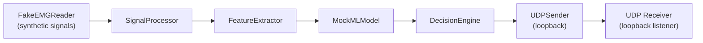

# Testing Strategy

## Overview

The system is designed to be fully testable **without physical hardware** using:
- **FakeEMGReader**: Generates synthetic EMG signals
- **MockMLModel**: Deterministic classifier
- **MockActuator**: Serial-print actuator
- **UDP loopback**: Test packet transmission on localhost

## Test Categories

### Unit Tests (PC)

| Test File | Component | Key Tests |
|-----------|-----------|-----------|
| `test_ring_buffer.cpp` | RingBuffer\<T\> | Push/pop, overflow (overwrite), empty pop, capacity, SPSC concurrent |
| `test_thread_safe_queue.cpp` | ThreadSafeQueue\<T\> | Push/pop, blocking pop, bounded overflow, shutdown wakeup, multi-producer |
| `test_signal_processor.cpp` | SignalProcessor | Bandpass filter correctness, DC removal, normalization range |
| `test_feature_extractor.cpp` | FeatureExtractor | RMS, MAV, Variance, WL, ZC, SSC with known inputs |
| `test_mock_ml.cpp` | MockMLModel | Deterministic classification, confidence ranges |
| `test_decision_engine.cpp` | DecisionEngine | Confidence threshold, class→command mapping, edge cases |
| `test_command_packet.cpp` | CommandPacket | Serialize/deserialize roundtrip, CRC validation, corruption detection |
| `test_udp_sender.cpp` | UDPSender | Loopback send/receive, packet integrity |
| `test_pipeline.cpp` | Pipeline | End-to-end: FakeEMG → MockML → UDP (integration) |

### Running Unit Tests

```bash
cd pc/build
cmake .. -DBUILD_TESTING=ON
cmake --build .
ctest --output-on-failure
```

### Running the Python ESP32 Simulator

For live testing without physical hardware, launch the simulator:

```bash
python tests/simulate_esp32.py 8888
```

The simulator validates CRC-16, checks sequence monotonicity, visualizes simulated servo angles (0° / 90° / 180°), and enforces a 500ms safety watchdog that triggers neutral safe-state when packets stop.

### Automated End-to-End Integration Test

```bash
python tests/test_integration_e2e.py
```

Spawns the PC executable, captures binary UDP packets over localhost, validates full CRC and sequence monotonicity, and verifies clean shutdown.

### Test Assertions

All tests use a minimal assertion framework (no external dependencies):

```cpp
#define ASSERT_TRUE(expr) ...
#define ASSERT_EQ(a, b) ...
#define ASSERT_NEAR(a, b, epsilon) ...
```

## End-to-End Test Pipeline



This pipeline runs entirely on the PC with no hardware dependencies.

## Safety Tests

| Scenario | Expected Behavior |
|----------|------------------|
| ML confidence below threshold | `Command::NONE` generated |
| Invalid class_id from ML | `Command::NONE` generated |
| Corrupted UDP packet | ESP32 discards silently |
| Out-of-order sequence number | ESP32 discards |
| No packets for `WATCHDOG_TIMEOUT_MS` | ESP32 enters safe state |
| Queue shutdown during blocking pop | Consumer wakes up, returns nullopt |
| Ring buffer overflow | Oldest samples overwritten |
