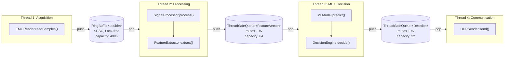
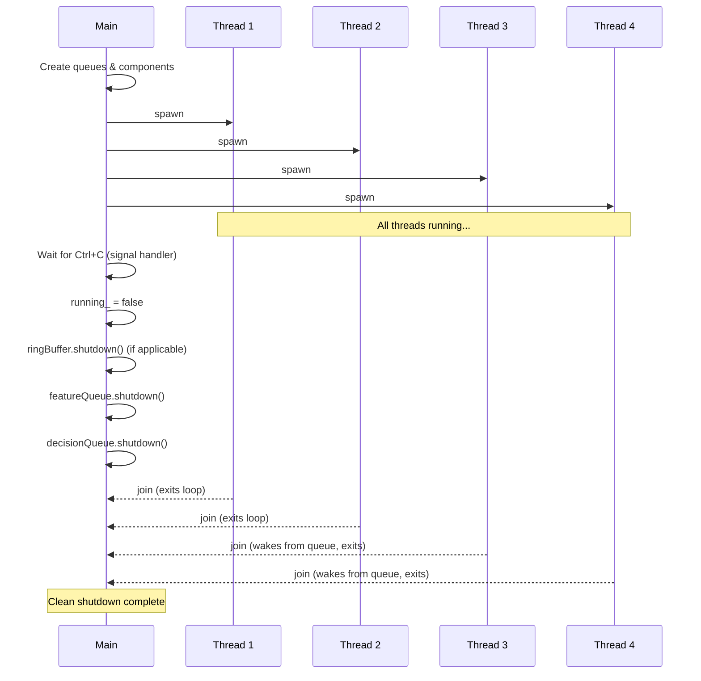

# Threading Model

## Overview

The PC application uses **4 dedicated threads** connected by **thread-safe queues**.
Each thread has a single, clearly defined responsibility. No mutable state is shared
between threads without synchronization.

## Thread Architecture

## Thread Specifications

### Thread 1: EMG Acquisition

| Property | Value |
|----------|-------|
| **Responsibility** | Read raw EMG samples from sensor |
| **Input** | EMGReader (serial port or fake generator) |
| **Output** | RingBuffer\<double\> |
| **Frequency** | 1000 Hz (configurable, sensor-dependent) |
| **Blocking behavior** | Blocks on sensor read (or timer for fake) |
| **Shutdown** | Checks `std::atomic<bool> running_` each iteration |

**Why this is a separate thread**: EMG acquisition is time-critical and must not be
delayed by downstream processing. The ring buffer ensures that if processing is slow,
old samples are overwritten rather than causing memory growth.

### Thread 2: Signal Processing + Feature Extraction

| Property | Value |
|----------|-------|
| **Responsibility** | Filter raw EMG and compute feature vectors |
| **Input** | RingBuffer\<double\> (pops windows of N samples) |
| **Output** | ThreadSafeQueue\<FeatureVector\> |
| **Window size** | 256 samples (configurable) |
| **Overlap** | 128 samples (50%, configurable) |
| **Blocking behavior** | Busy-waits/sleeps until enough samples in ring buffer |
| **Shutdown** | Checks `running_` flag |

**Why combined**: Signal processing and feature extraction are logically sequential
and operate on the same data window. Splitting them would add queue overhead with
no latency benefit.

### Thread 3: ML Inference + Decision

| Property | Value |
|----------|-------|
| **Responsibility** | Run ML model, apply confidence threshold, produce command |
| **Input** | ThreadSafeQueue\<FeatureVector\> |
| **Output** | ThreadSafeQueue\<Decision\> |
| **Blocking behavior** | Blocks on FeatureQueue.pop() (condition variable) |
| **Shutdown** | Wakes up when queue is shut down, checks `running_` |

**Why separate from Thread 2**: ML inference may have variable and unpredictable
latency (especially with real TFLite/ONNX models). Keeping it separate prevents
ML spikes from blocking feature extraction.

### Thread 4: UDP Communication

| Property | Value |
|----------|-------|
| **Responsibility** | Serialize decisions and send UDP packets |
| **Input** | ThreadSafeQueue\<Decision\> |
| **Output** | UDP packets to ESP32 |
| **Blocking behavior** | Blocks on DecisionQueue.pop() (condition variable) |
| **Shutdown** | Wakes up when queue is shut down, sends final NONE command |

**Why separate**: Network I/O should not block the decision pipeline. Also allows
future extension (e.g., adding TCP feedback channel, logging to network).

## Synchronization Primitives

### RingBuffer\<T\> (Thread 1 → Thread 2)

- **Type**: Single-Producer Single-Consumer (SPSC) lock-free ring buffer
- **Mechanism**: Two `std::atomic<size_t>` indices (head, tail) with acquire/release ordering
- **Why lock-free**: Thread 1 runs at 1 kHz+; mutex contention would cause jitter
- **Overflow**: When full, `push()` overwrites the oldest entry (tail advances)
- **Underflow**: `tryPop()` returns `false` if empty

### ThreadSafeQueue\<T\> (Thread 2 → 3, Thread 3 → 4)

- **Type**: Bounded queue with mutex + condition_variable
- **Mechanism**: `std::mutex` protects `std::queue<T>`; `std::condition_variable` for blocking pop
- **Why mutex-based**: Lower frequency (10–50 Hz), blocking semantics needed
- **Overflow**: When full, `push()` drops the oldest entry (front of queue)
- **Shutdown**: `shutdown()` sets a flag, notifies all waiters, `pop()` returns `std::nullopt`

### Shared Flags

- `std::atomic<bool> running_` — checked by all threads each iteration
- No other mutable state is shared between threads

## Lifecycle Management

## Deadlock Prevention

1. **No circular waits**: Data flows strictly left-to-right (T1 → T2 → T3 → T4). No thread waits on a predecessor.
2. **Single lock per queue**: Each queue has exactly one mutex. No thread holds two locks simultaneously.
3. **Shutdown mechanism**: `shutdown()` wakes all blocked consumers via `notify_all()`, ensuring no thread sleeps forever.
4. **Atomic running flag**: Checked without locking. All threads exit their main loop when `running_ == false`.

## Performance Considerations

| Metric | Value | Rationale |
|--------|-------|-----------|
| Ring buffer capacity | 4096 samples | ~4 seconds at 1 kHz; prevents overflow during brief processing delays |
| Feature queue capacity | 64 entries | ~3 seconds of feature vectors at 20 Hz window rate |
| Decision queue capacity | 32 entries | ~1.5 seconds of decisions; rarely fills |
| Lock-free ring buffer | Yes | Eliminates mutex jitter on the hot path (Thread 1) |
| Condition variable waits | Threads 3, 4 | Low-frequency consumers should sleep, not busy-wait |
